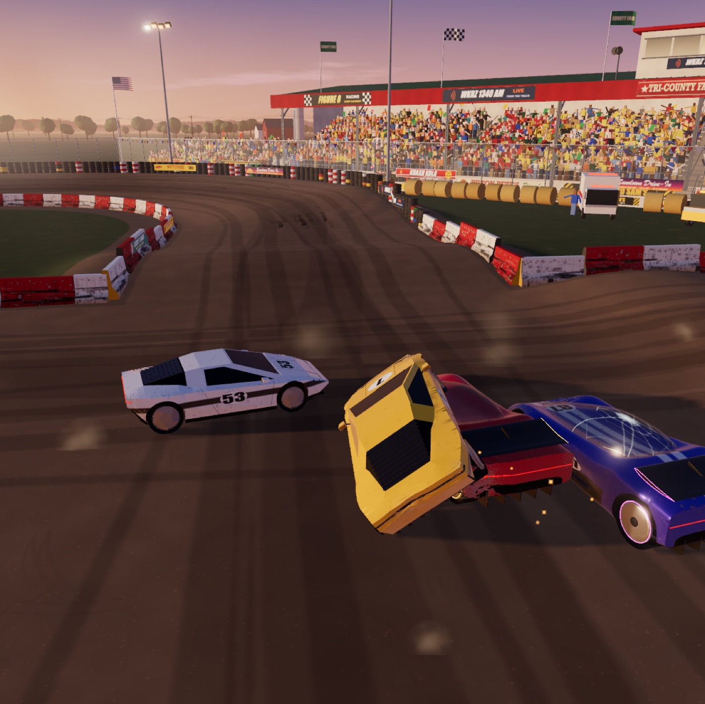
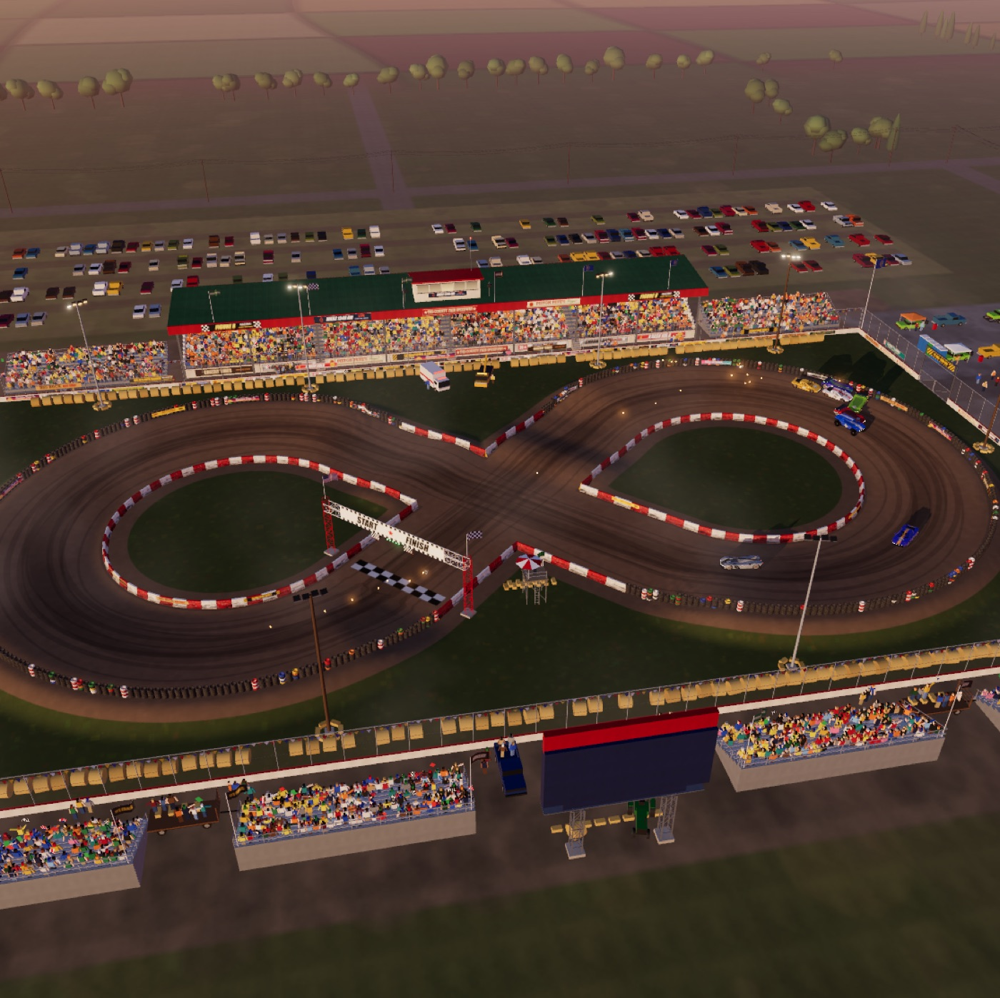
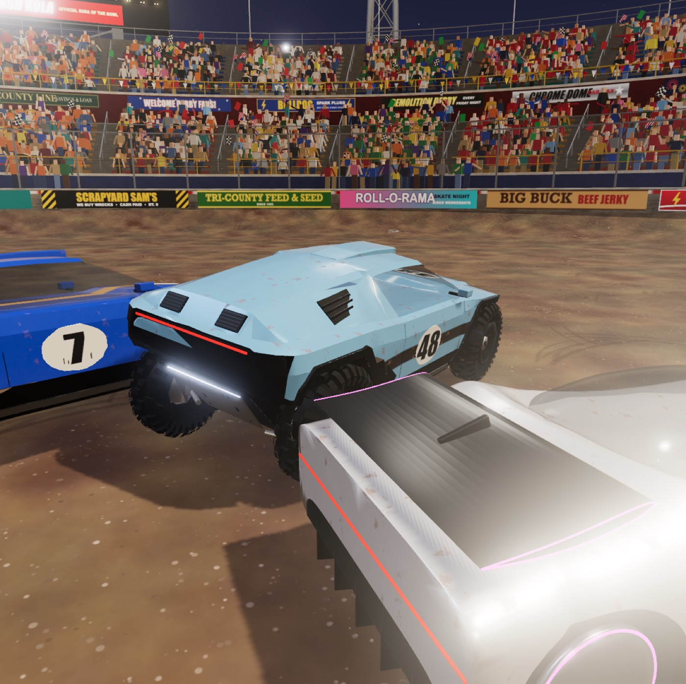

# Demolition Derby

A demolition derby for the browser in the spirit of *Destruction Derby* (PlayStation, 1995), played with
the five Collect Car models: hypercar, wedge, rally truck, endurance prototype and streamliner. Race a
dusk figure 8 whose straights cross in the middle, or be the last car running in the floodlit Bowl. Cars
dent where they're hit, glass cracks, wings tear off, and radiators steam, smoke and burn.

**▶ Play it: https://drcollect.github.io/demolition-derby/** (desktop browser, keyboard or gamepad)



| | |
|---|---|
|  |  |

## Made with Claude Code

Every line of code, the Blender pipeline for the cars and the scenery came out of a conversation with
Claude Code; the prompts were plain words, typos and all. A few of them:

- *"I want to build a Demolition Derby, probably with Three.js … at some point they will be demolished …
  they should get dents, I don't know, maybe glass can break … There was a PlayStation game … I also
  remember one level was basically a round stadium."* Claude researched the 1995 game (the Bowl, and
  scoring where spinning a car 90° earns 2 points and 360° earns 10) and built the derby.
- *"Use these assets … make them kind of move, rotating wheels … color them cool."* A Blender script
  rebuilt the five Collect Car models for crashing: wheels that spin and steer, glass that cracks, parts
  that tear off, and bodies with enough vertices to dent.
- *"Can you make like a cross race? … like an eight … at some point they're gonna hit each other on that
  crossing … and the scenario is more like these motocross scenarios, could be a little bit of ramps."*
  The Figure 8, with AI that decides at the X whether to lift or go for the T-bone.
- *"is there sound"*: procedural engines, crashes and crowd, no audio files at all.

`BRIEF.md` has the research and the design, and `ASSETS.md` covers how the cars are prepared.

## Play locally

```bash
git clone https://github.com/drcollect/demolition-derby.git
cd demolition-derby/game && npm install && npm run dev
```

Then open http://127.0.0.1:5190. `npm run build` makes a static build in `game/dist/`;
`npm run build:pages` builds the GitHub Pages version (served from `/demolition-derby/`), and
`npm run publish:pages` builds it and pushes it to the `gh-pages` branch, which the site serves.

**Controls:** W/↑ throttle · S/↓ brake, then reverse · A/D or ←/→ steer · Space handbrake · C camera
(chase, far chase, hood, bumper) · V or B look back · R flip the car over (in a race: back onto the
track) · H horn · Esc pause · M mute · F3 or \` shows fps. A gamepad works too: RT/LT throttle and brake,
left stick steer, A handbrake, Y camera, B look back.

**Sound** starts on the first click or key press (browsers block audio until then). The badge under the
clock says whether it's on. The sound pauses while the tab is hidden.

## The game

- **Events:** the Figure 8 race (the default), Destruction Derby, or Total Destruction, where every other
  car is out to get you.
- **The Figure 8:** a dirt track at a county fair at dusk, with two banked loops (24 m radius) and two
  straights that cross at 90° in the middle, so the field drives through its own traffic twice a lap.
  Each straight has a roller jump just after the crossing. The track is 322 m long; a clean lap takes
  about 18–20 s.
  - Race 3, 5, 10 (default) or 15 laps, with a 10-minute limit. You start from the back of the grid.
  - When the winner takes the flag, everyone else finishes the next time they cross the line (lapped
    cars finish a lap or more down).
  - A car thrown over a barrier, flipped or stuck is put back on the track a few metres behind where it
    was (R does it for you). Wrecks are towed to a scrapyard in the loop infields.
  - The AI brakes for the loops (and before the jumps, as there are no brakes in the air), passes slower
    cars, and at the crossing either lifts to let traffic through or keeps its foot in and T-bones it,
    depending on the driver.
- **The Bowl:** a round dirt arena 60 m across, with a banked rim, a concrete wall and a catch fence,
  under floodlights with a crowd. You and 1–11 AI cars start around the rim facing the middle. Last car
  running wins, or the most points when the 4-minute clock runs out.
- **Garage:** pick your car and give it a paint colour, a neon accent (light strips and wheel rings),
  racing stripes and a door number.
- **Points** follow the original: spinning a car 90° = 2, 180° = 4, 360° = 10, wrecking one = 10 (it goes
  to the last car to hit it within 8 seconds). The last car running gets a 10-point bonus (our rule).
- **Damage** has four zones (front, rear, left, right) plus four wheels, shown on the HUD car outline.
  - Front: the radiator steams, then smokes, the engine loses power, and at 100% the car is wrecked.
  - Rear: less acceleration and top speed.
  - Sides and wheels: the steering pulls and loses lock; a destroyed corner loses its wheel.
  - Visual damage: the car dents where it's hit, the paint is scraped to bare metal, glass cracks and
    then crazes, lights go dark, and wings, splitters, diffusers, mirrors, fins and skid plates tear off
    and lie on the ground. Wrecks smoke, burn and stay put as obstacles.
- **AI** in the Bowl uses the original manual's "Destruction Derby Code": it aims for rear quarters to
  spin cars, backs into cars to save its radiator, turns side-on to head-on attackers, brake-checks
  tailgaters, pins cars to the wall, and gets itself unstuck. Eleven drivers have their own aggression,
  caution and taste for reversing. Difficulty is Rookie, Amateur or Pro.

## What's here

| Path | What |
|---|---|
| `game/` | The game (Vite + TypeScript + Three.js r186 + Rapier 0.20 physics + Web Audio). |
| `game/public/models/cars/` | The five cars (`<id>.glb`) and `cars.json`. |
| `BRIEF.md` | Research on the original game and the design of this one. |
| `ASSETS.md` | How the Collect Car models are turned into game cars, and what the game expects from a car. |
| `scripts/prepare_cars.py` | The Blender script that prepares the cars from the Collect Car exports (run with `scripts/blender.sh`, Blender 5.2 in the background). |
| `media/` | Screenshots. |

## Code map (`game/src`)

| Folder | What |
|---|---|
| `car/vehicle.ts` | Raycast vehicle: spring/damper suspension and a stick-then-slide tyre model on a Rapier body. |
| `car/car.ts` | A car in the arena: visuals, physics body, damage state, loose parts, effects. |
| `car/damage.ts` | Denting (vertex displacement with crumple, crush limits and crease-preserving normals), zones. |
| `car/materials.ts` | Paint shader that shows bare metal, rust and mud from damage. |
| `car/carAsset.ts` | Loads the prepared GLBs (placeholder boxes if a car is missing). |
| `car/decals.ts` | Projects door and hood numbers onto the bodies. |
| `car/specs.ts` | Handling and toughness of the five cars. |
| `game/match.ts` | One round: fixed 120 Hz physics, impacts from Rapier contact events, scoring, round flow. |
| `game/race.ts` | Lap counting, positions, the flag, respawns and towing on the Figure 8. |
| `ai/driver.ts`, `ai/racer.ts` | The derby AI and the racing AI. |
| `arena/bowl.ts`, `arena/stadium*` | The Bowl: floor, bank and wall, then stands, crowd, floodlights, scoreboard, sky. |
| `arena/figure8/track.ts` | The Figure 8: centreline, heights (banking, jumps), barriers, heightfield collider, ground. |
| `arena/figure8/venue*` | The county-fair speedway: golden-hour sky, farmland, barriers and tyre walls with sponsor boards, grandstands and crowd, start/finish gantry, LED scoreboard, flagman, pits, parking, a Ferris wheel. |
| `audio/` | Procedural engine, crash, glass, scrape and crowd sound (Web Audio, no samples). |
| `fx/` | Particles (sparks, smoke, fire, steam, dust, glass), skid marks, debris. |
| `ui/` | HUD and menus. |
| `dev/testkit.ts` | Dev-only helpers on `window.__ddt`: crash tests (`__ddt.duel('rally'); __ddt.headOn(12)`), headless races (`await __ddt.race(); __ddt.sim(60)`), frames (`__ddt.shot('name')`). |

## Private deployment (optional)

`game/api/` and `game/middleware.ts` put the same game behind a sign-in on Vercel: Google sign-in for an
allowlist of domains, plus username/password accounts (no sign-up). Accounts are managed with
`npm run user -- add|remove|list <name>`, which keeps scrypt hashes in `game/api/_lib/users.ts`; that file
isn't in this repository. Environment: `GOOGLE_CLIENT_ID`, `SESSION_SECRET` (32+ random characters), and
optionally `ALLOWED_DOMAINS` and `ALLOWED_EMAILS`.

## Networking (next step)

The game is set up for host-authoritative multiplayer:

- Every car is driven by a `DriverInput` (throttle, brake, steer, handbrake). Keyboard, gamepad and AI
  already produce these; a network peer would too.
- The simulation runs at a fixed 120 Hz step.
- Damage goes through `Car.applyLocalImpact()` with a car-space `LocalImpact` (point, direction, Δv,
  sequence number). Random choices are seeded from those values, so a client that gets the host's impact
  events reproduces the same dents, glass and loose parts. `Car.onImpact` is the hook for sending them.

The plan is for clients to send inputs, the host to run the physics and send snapshots (car transforms,
velocities, zone damage) plus impact events, and clients to interpolate.

## License

The code is under the [MIT license](LICENSE): the game, the Blender pipeline and the tooling.

**The cars are excluded.** The five Collect Car models in `game/public/models/cars/`, the car designs
they contain (also as seen in the screenshots) and the Collect names belong to Collect
(https://collect.app), all rights reserved. They're included so the game can be played; don't reuse them
outside it without permission. See [`game/public/models/cars/LICENSE.md`](game/public/models/cars/LICENSE.md).

The game's code and art were made with Claude Code.
